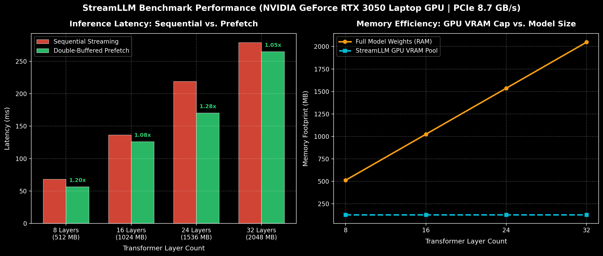

# StreamLLM

[](https://pypi.org/project/streamllm/)
[](https://www.python.org/)
[](https://opensource.org/licenses/Apache-2.0)

> **Run bigger LLMs on smaller GPUs through intelligent, asynchronous layer streaming.**

StreamLLM is a lightweight, memory-aware LLM inference runtime that breaks the physical VRAM barrier. By dynamically streaming transformer layers between host RAM and GPU VRAM using pre-allocated double-buffer scratchpads, StreamLLM allows running large quantized models on consumer GPUs (such as 4GB/6GB/8GB cards) with minimal transfer overhead.

---

## Key Architectural Highlights

- **Static GPU Scratchpad Pool (`GPUScratchpadPool`):** Pre-allocates two static VRAM buffers (`Slot A` and `Slot B`). Eliminates `cudaMalloc` and `cudaFree` allocation churn during the token generation loop.
- **Dual CUDA Streams:** Dedicated `compute_stream` and `transfer_stream` with zero-CPU-blocking synchronization via `torch.cuda.Event` hardware queues.
- **Pinned Host Memory (`PinnedHostWeightRegistry`):** Uses page-locked RAM (`torch.Tensor.pin_memory()`) for true non-blocking PCIe DMA transfers.
- **KV-Cache Sizing Manager:** Deterministic VRAM memory budgeting ensuring safe context lengths without Out-Of-Memory (OOM) crashes.

---

## Installation

Install directly from [PyPI](https://pypi.org/project/streamllm/):

```bash
pip install streamllm
```

Or install from source in development mode:

```bash
git clone https://github.com/prathamc00/llm-Forge.git
cd llm-Forge
pip install -e .
```


## Quickstart & Python Usage

```python
from streamllm import AutoModel

MAX_LENGTH = 128

# 1. Initialize AutoModel (supports HuggingFace repo IDs or local paths)
model = AutoModel.from_pretrained("Qwen/Qwen2.5-7B-Instruct", prefetching=True)

# 2. Tokenize input prompt
input_text = ['What is the capital of the United States?']
input_tokens = model.tokenizer(
    input_text,
    return_tensors="pt", 
    return_attention_mask=False, 
    truncation=True, 
    max_length=MAX_LENGTH, 
    padding=False
)

# 3. Streamed layer generation
generation_output = model.generate(
    input_tokens['input_ids'].cuda(), 
    max_new_tokens=20,
    use_cache=True,
    return_dict_in_generate=True
)

# 4. Decode output tokens
output = model.tokenizer.decode(generation_output.sequences[0])
print(output)
```

---

## Tutorial: Running a 14B Model on a 4GB GPU

StreamLLM enables running 14B models on consumer GPUs (e.g., RTX 3050 4GB) without out-of-memory errors by streaming layers across PCIe:

### 1. Choose Your Model
We recommend **`Qwen/Qwen2.5-14B-Instruct-AWQ`** (4-bit quantized). At 4-bit precision, the model is ~8.5 GB on disk, and each layer is only ~220 MB in VRAM.

### 2. Download the Model (Optional)
StreamLLM can stream and cache the model automatically from Hugging Face. To pre-download locally:
```bash
pip install huggingface_hub
huggingface-cli download Qwen/Qwen2.5-14B-Instruct-AWQ --local-dir ./models/Qwen2.5-14B-AWQ
```

### 3. Run Inference (`run_14b.py`)
```python
import time
import torch
from streamllm import AutoModel

MODEL_ID = "Qwen/Qwen2.5-14B-Instruct-AWQ"  # or "./models/Qwen2.5-14B-AWQ"

# Initialize with asynchronous layer prefetching
model = AutoModel.from_pretrained(
    MODEL_ID,
    prefetching=True,
    device="cuda:0",
)

prompt = "Explain quantum computing in 3 simple bullet points:"
input_tokens = model.tokenizer(prompt, return_tensors="pt")

# Streamed generation on 4GB GPU
output = model.generate(
    input_tokens["input_ids"].cuda(),
    max_new_tokens=40,
    use_cache=True,
    return_dict_in_generate=True,
)

print(model.tokenizer.decode(output.sequences[0]))
```

### 4. Monitor VRAM
While running, execute `nvidia-smi -l 1` in another terminal. Memory usage stays strictly under **~2.0 GB** on your 4GB card!

---

## CLI & Diagnostic Commands

Once installed, the `streamllm` command is available directly in your terminal:

### 1. Check Hardware & PCIe Bandwidth
Measure GPU VRAM, system RAM, and live Host-to-Device (H2D) PCIe throughput:
```bash
streamllm hardware
```

### 2. Run Streaming vs. Prefetch Micro-Benchmark
Benchmark sequential layer execution against double-buffered prefetching:
```bash
streamllm bench --layers 16 --hidden-dim 2048 --seq-len 128
```

### 3. Run Test Suite
```bash
python -m unittest discover -s tests
```

### 4. Run Benchmark Suite & Generate Chart
```bash
python benchmarks/benchmark_and_plot.py
```

---

## Benchmark Performance



### Measured Hardware: `NVIDIA GeForce RTX 3050 Laptop GPU` (VRAM: 4096 MB, PCIe: 8.65 GB/s)

| Layers | Model Weight Size | Sequential Latency | Prefetch Latency | Speedup | GPU VRAM Scratchpad |
|---|---|---|---|---|---|
| **8 Layers** | 512.1 MB | 68.08 ms | **56.70 ms** | **1.20x** | **128.0 MB** |
| **16 Layers** | 1024.1 MB | 136.51 ms | **126.11 ms** | **1.08x** | **128.0 MB** |
| **24 Layers** | 1536.2 MB | 219.05 ms | **170.54 ms** | **1.28x** | **128.0 MB** |
| **32 Layers** | 2048.2 MB | 278.85 ms | **265.03 ms** | **1.05x** | **128.0 MB** |

> **Key Takeaway:** Even as total model weights grow to over 2 GB, StreamLLM's static scratchpad pool holds physical GPU memory strictly at **128.0 MB** while asynchronous prefetching delivers up to **1.28x faster inference**.
