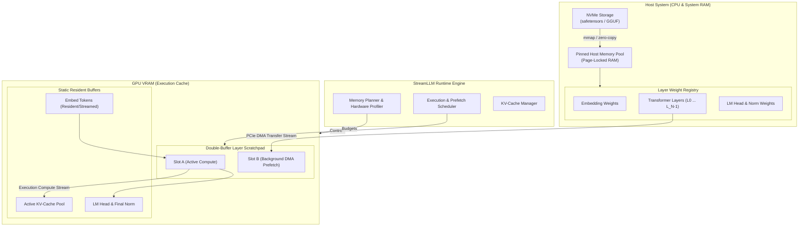

# StreamLLM --- Product Requirements Document & Technical Architecture

## Project Name

**StreamLLM**

### Tagline

**Run bigger LLMs on smaller GPUs through intelligent, asynchronous layer streaming.**

---

# 1. Executive Summary & Overview

Modern Large Language Models (LLMs) are strictly bound by GPU memory capacity. While model quantization (INT8, INT4, GGUF/AWQ) drastically compresses weights, 14B, 30B, and 70B parameter models remain inaccessible on consumer GPUs with 4 GB to 8 GB of VRAM.

**StreamLLM** is a high-performance, lightweight LLM inference runtime engineered to run models that exceed physical VRAM capacity. 

Rather than pinning the entire model graph in GPU memory, StreamLLM treats the GPU as a high-speed execution cache:
- The base model resides in system host RAM (or is memory-mapped directly from NVMe SSD storage).
- Transformer layers are dynamically streamed into pre-allocated GPU scratchpads via asynchronous PCIe Direct Memory Access (DMA).
- High-priority compute operations overlap seamlessly with background prefetching of upcoming layers using dual CUDA streams and hardware events.

The result is a zero-configuration runtime that allows consumer GPUs (e.g., RTX 3050 4GB, RTX 4060, mobile GPUs) to reliably run 14B+ models with low memory overhead.

---

# 2. Problem Statement & Physics of Inference

## 2.1 The VRAM Wall
On consumer hardware, users face an all-or-nothing threshold: if a model requires 9.2 GB of memory, a 4 GB or 8 GB card encounters `CUDA out of memory` during weight allocation, rendering the GPU useless.

Naive CPU offloading (e.g., standard sequential layer-by-layer offloading) suffers from massive transfer overhead:
```text
Layer N: [Transfer: 25ms] ──> [Compute: 2ms] ──> [Wait/Free: 5ms]
GPU Utilization: < 10%
```

## 2.2 The Asymmetry: Prefill vs. Decode
A critical requirement in StreamLLM is recognizing that LLM inference operates in two fundamentally different hardware regimes:

| Attribute | Prefill Phase (Prompt Processing) | Decode Phase (Token Generation) |
|---|---|---|
| **Batch / Sequence ($M$)** | Large ($M = \text{prompt\_tokens}$, e.g. 512–2048) | Single token ($M = 1$) |
| **Arithmetic Intensity** | High (FLOPs / byte is high) | Very Low (Memory bandwidth bound) |
| **Layer Compute Time** | Substantial (15ms – 80ms per layer) | Microseconds (0.5ms – 2.5ms per layer) |
| **PCIe Transfer Time** | Identical (e.g. 15ms for a 200MB layer over PCIe 3.0 x16) | Identical (15ms for a 200MB layer) |
| **Overlap Feasibility** | **High:** Compute can completely hide transfer latency! | **Challenging:** Transfer dominates compute time. |

StreamLLM designs explicit scheduling optimizations tailored for both phases, leveraging quantization (INT4/INT8) to cut PCIe transfer payloads by $2\times$ to $4\times$.

---

# 3. Vision & Principles

### Core Principle
```text
Don't ask: "How do I fit the entire model into VRAM?"
Ask:      "What layer does the GPU need right now, and what layer will it need next?"
```

### Design Tenets
1. **Zero Dynamic VRAM Allocation During Inference:** Pre-allocate static GPU memory pools at startup. Eliminate `cudaMalloc` and `cudaFree` calls during the token loop to eliminate memory fragmentation and driver latency.
2. **Lock-Free Asynchrony:** Compute operations on `compute_stream` must synchronize with transfers on `transfer_stream` strictly via non-blocking CUDA hardware events (`cudaEventRecord`, `cudaStreamWaitEvent`), keeping CPU overhead near zero.
3. **Transparent Execution:** Expose standard CLI commands and OpenAI/HuggingFace-compatible interfaces. The user should never need to manually partition model layers.

---

# 4. Goals & Non-Goals

## 4.1 Primary Goals
1. Execute models whose weights exceed available VRAM by up to $3\times$ to $4\times$.
2. Implement **static double-buffer scratchpads** in VRAM for zero-allocation layer streaming.
3. Overlap compute and PCIe transfer using dual CUDA streams and pinned host memory (`torch.Tensor.pin_memory()`).
4. Support 4-bit and 8-bit quantized models to minimize PCIe bus saturation.
5. Provide a deterministic KV-cache budgeting mechanism that prevents out-of-memory errors during long context generation.
6. Build a reproducible benchmark suite measuring Time-To-First-Token (TTFT), tokens/second, PCIe bus utilization, and GPU idle time.
7. Deliver a clean CLI (`streamllm run`) and Python SDK (`from streamllm import LLM`).

## 4.2 Non-Goals
- Building a new model training framework.
- Inventing new proprietary quantization formats (we adopt standard AWQ, GPTQ, GGUF, or bitsandbytes).
- Modifying OS kernels or proprietary GPU display drivers.
- Claiming streaming decode speed will match 100% VRAM-resident inference on enterprise high-bandwidth hardware (H100/A100).

---

# 5. Target Hardware Baseline

```text
Minimum Spec:
- GPU: NVIDIA RTX-series / GTX 16-series (Turing, Ampere, Ada, or newer)
- VRAM: 4 GB GDDR6
- System RAM: 16 GB DDR4/DDR5
- Interconnect: PCIe 3.0 x8 (approx. 7.8 GB/s bidirectional) or PCIe 4.0 x16 (approx. 31.5 GB/s)
- OS: Windows 10/11 (64-bit) or Linux (Ubuntu 22.04+)

Recommended Spec:
- GPU: RTX 3060 6GB / 4060 8GB
- System RAM: 32 GB
- Storage: NVMe PCIe Gen 4 SSD (for memory-mapped direct loading)
```

---

# 6. System Architecture



---

# 7. Core Architectural Components

## 7.1 Hardware Profiler & Bandwidth Meter
- Queries GPU device limits via `cudaGetDeviceProperties` / NVML:
  - Total VRAM, currently reserved VRAM, free VRAM.
  - Compute capability and tensor core generation.
- Executes an initial 100MB micro-benchmark measuring actual host-to-device (H2D) PCIe throughput (GB/s).
- Dynamically calculates the layer streaming budget:
$$\text{Available VRAM Budget} = \text{VRAM}_{\text{total}} - (\text{OS/Driver Reserve}) - \text{VRAM}_{\text{KV}}(T_{\text{max}})$$

## 7.2 Model Analyzer & Safetensors Inspector
- Inspects model architecture without instantiating full PyTorch weights in memory:
  - Header inspection of `.safetensors` or quantized checkpoint files.
  - Determines layer homogeneity (e.g. 32 identical decoder blocks of 220 MB each).
  - Isolates non-block weights: `model.embed_tokens.weight`, `model.norm.weight`, `lm_head.weight`.
- Generates a per-layer memory profile table.

## 7.3 Host Pinned Memory Manager (`HostPinnedPool`)
- **Crucial Requirement:** Standard pageable CPU memory blocks PyTorch transfer calls. StreamLLM mandates page-locked (pinned) allocations (`cudaHostAlloc` / `torch.Tensor.pin_memory()`).
- Employs zero-copy memory mapping (`safetensors.torch.load_file` directly into pinned host tensors).
- Maintains a registry of CPU pointers indexed by layer ID:
```python
class HostWeightRegistry:
    def __init__(self, model_path: str):
        # Mmap weights directly into pinned host buffers
        self.layers = [load_pinned_layer(i) for i in range(num_layers)]
        self.embed_tokens = load_pinned_layer("embed")
        self.lm_head = load_pinned_layer("lm_head")
```

## 7.4 GPU Double-Buffer Scratchpad (`GPUScratchpadPool`)
- Pre-allocates two static GPU memory buffers matching the maximum layer dimension:
  - `Slot A (VRAM)`: Dedicated to the active computation.
  - `Slot B (VRAM)`: Dedicated to the incoming background DMA transfer.
- Zero `torch.empty` or `torch.cuda.empty_cache()` calls during token generation.
- Weight swapping is performed via zero-allocation tensor pointer updates:
```text
Cycle 0: Slot A = Compute(Layer 0) | Slot B = DMA_Transfer(Layer 1)
Cycle 1: Slot B = Compute(Layer 1) | Slot A = DMA_Transfer(Layer 2)
Cycle 2: Slot A = Compute(Layer 2) | Slot B = DMA_Transfer(Layer 3)
```

## 7.5 Dual CUDA Stream Transfer Engine
To guarantee zero-CPU-stalling execution, StreamLLM establishes two dedicated hardware queues:
1. `compute_stream = torch.cuda.Stream()`
2. `transfer_stream = torch.cuda.Stream()`

Synchronized via CUDA Hardware Events (`torch.cuda.Event`):
- `transfer_done_event`: Signals that Slot B has finished receiving weights over PCIe.
- `compute_done_event`: Signals that Slot A has finished using its weights and can be safely overwritten.

```text
Transfer Stream: [DMA L_n+1 into Slot B] ──> [Record: transfer_done]
                                                   │
Compute Stream:  [Wait: transfer_done] <───────────┘
                 [Compute L_n+1 on Slot B] ──> [Record: compute_done]
                                                     │
Transfer Stream: [Wait: compute_done] <──────────────┘
                 [DMA L_n+2 into Slot A]
```

## 7.6 KV-Cache Lifecycle & VRAM Budgeting
Autoregressive decoding demands past Key and Value activations for every layer.
- **Formula for KV-Cache Size:**
$$\text{Memory}_{\text{KV}} = 2 \times n_{\text{layers}} \times n_{\text{kv\_heads}} \times d_{\text{head}} \times \text{context\_length} \times \text{bytes\_per\_elem}$$
*Example for 14B model (40 layers, 8 KV heads, 128 dim, FP16, 2048 tokens):*
$$2 \times 40 \times 8 \times 128 \times 2048 \times 2 \approx 335.5\text{ MB}$$
- **Placement Policy:**
  - **Context $\le 2048$ tokens:** Retain KV cache permanently in GPU VRAM (335 MB fits comfortably alongside two 250 MB layer scratchpads).
  - **Context $> 2048$ tokens (v0.3+):** Paged KV-Cache or streaming layer KV cache alongside layer weights.

## 7.7 Non-Transformer Block Strategy (`embed_tokens` & `lm_head`)
In models with large vocabulary sizes (e.g. Qwen: 152k, Gemma: 256k), `embed_tokens` and `lm_head` can consume 500 MB – 1.5 GB.
- **Tied Embeddings:** If `tie_word_embeddings == True`, a single buffer is reused.
- **Untied Embeddings / Constrained VRAM:**
  - `embed_tokens` runs at token 0 on GPU, then can be offloaded if memory is critical.
  - `lm_head` is loaded dynamically only after the final layer completes, or pinned in a dedicated persistent 500 MB slot if VRAM allows.

---

# 8. Memory Layout & Budget Formula

### Total Peak VRAM Consumption Formula
$$VRAM_{\text{peak}} = VRAM_{\text{base}} + VRAM_{\text{scratchpad}} + VRAM_{\text{head\_embed}} + VRAM_{\text{KV}}(T) + VRAM_{\text{activation}}$$

Where:
- $VRAM_{\text{base}}$: PyTorch CUDA runtime and driver context (~400 MB – 600 MB).
- $VRAM_{\text{scratchpad}}$: 2 $\times$ Layer Size (Double buffering, e.g. $2 \times 210\text{ MB} = 420\text{ MB}$).
- $VRAM_{\text{head\_embed}}$: Resident embedding and LM projection heads (~500 MB).
- $VRAM_{\text{KV}}(T)$: Active Key-Value cache for context length $T$ (~300 MB for 2K context).
- $VRAM_{\text{activation}}$: Intermediate layer activation tensors (~50 MB for batch size 1).

**Total Peak Footprint for a 14B Model:** $\approx 1.8\text{ GB} - 2.2\text{ GB}$ VRAM!  
*(Fits effortlessly on a 4 GB GPU!)*

---

# 9. Execution Pipeline: Prefill vs. Decode

```text
================================================================================
PREFILL PHASE (Prompt: 512 tokens) - Compute Bound
================================================================================
Compute Stream:  [=== Compute L0 (45ms) ===] [=== Compute L1 (45ms) ===]
Transfer Stream: [ DMA L1 (18ms) ]           [ DMA L2 (18ms) ]
PCIe Overlap:    100% of transfer time is completely hidden by compute!
GPU Utilization: ~90-95%
--------------------------------------------------------------------------------
DECODE PHASE (Token Generation: M=1) - PCIe Bandwidth Bound
================================================================================
Compute Stream:  [Comp L0 (1.5ms)]           [Comp L1 (1.5ms)]
Transfer Stream: [======= DMA L1 (18ms) =======] [======= DMA L2 (18ms) =======]
Bottleneck:      Compute waits for DMA completion.
Optimization:    Use 4-bit quantization (reduces DMA from 18ms to 4.5ms)
                 + Speculative multi-token decoding (computes multiple tokens per pass).
================================================================================
```

---

# 10. CLI & API Specification

## 10.1 Command-Line Interface
StreamLLM provides a clean, single-command interface:

```bash
# Basic run with auto hardware detection
streamllm run meta-llama/Llama-3-8B-Instruct --prompt "Explain quantum computing in simple terms."

# Explicit memory budget and window configuration
streamllm run ./models/Qwen2.5-14B-Instruct-AWQ \
  --vram-limit 3.5GB \
  --buffer-slots 2 \
  --max-context 2048 \
  --temperature 0.7
```

Interactive chat mode:
```bash
streamllm chat ./models/Qwen2.5-14B-Instruct-AWQ
```

Benchmarking mode:
```bash
streamllm bench ./models/Qwen2.5-14B-Instruct-AWQ --prompt-len 512 --gen-len 128 --runs 5
```

## 10.2 Python Developer SDK
```python
from streamllm import LLM, StreamingConfig

# Configure memory constraints
config = StreamingConfig(
    max_vram_gb=3.8,          # Peak VRAM allocation cap
    buffer_slots=2,           # Double buffering (Slot A / Slot B)
    pinned_host_memory=True,  # Page-locked RAM transfers
    quantization="int4",      # 4-bit weight streaming
)

# Initialize runtime
model = LLM.from_pretrained("Qwen/Qwen2.5-14B-Instruct", config=config)

# Autoregressive generation
response = model.generate(
    "List 3 high-protein breakfast options.",
    max_new_tokens=100,
    stream=True
)

for token in response:
    print(token, end="", flush=True)
```

---

# 11. Implementation Roadmap & Milestones

```text
v0.1: PoC Sequential
├── PyTorch custom execution loop
├── Single layer swapped sequentially
└── Verification: 14B runs on 4GB VRAM without OOM

v0.2: Asynchronous Double-Buffering
├── Static Slot A / Slot B GPU memory pool
├── Dual CUDA streams (compute + transfer)
├── Pinned host memory integration
└── Zero allocation during token generation loop

v0.3: Adaptive Memory & KV-Cache Management
├── Dynamic context length budgeting
├── Quantized layer transfer (4-bit AWQ / GGUF)
└── Fallback CPU execution for non-layer operators

v0.4: Telemetry & Benchmark Suite
├── Automated comparison against naive offloading
├── Metrics: TTFT, Tokens/sec, PCIe bandwidth saturation, GPU idle %
└── Rich terminal dashboard / profiling output

v0.5: Speculative Multi-Token Decoding (Future)
├── Draft-head / Medusa integration
└── Compute 2-4 tokens per layer pass to overcome decode transfer bottlenecks
```

---

# 12. Benchmark Suite & Evaluation Criteria

StreamLLM benchmarks must strictly measure and report:

| Metric | Target (4GB VRAM, PCIe 3.0/4.0) | Description |
|---|---|---|
| **Peak VRAM** | $< 3.5 \text{ GB}$ strictly enforced | Never trigger `CUDA OOM` on 4GB hardware |
| **Prefill TTFT** | Overlap $\ge 80\%$ of transfer latency | Time-to-first-token during prompt processing |
| **Decode Throughput (INT4)** | $\ge 5 - 10 \text{ tokens/sec}$ | Autoregressive generation speed on consumer GPU |
| **GPU Utilization (Prefill)** | $\ge 85\%$ | Compute stream efficiency during prompt prefill |
| **Allocation Churn** | **0 bytes** allocated/freed in token loop | Proves static double-buffering stability |

---

# 13. Summary & Project Definition

> **StreamLLM is an open-source, memory-aware LLM inference runtime that breaks the VRAM barrier. By decoupling layer execution from memory capacity through asynchronous double-buffering, pinned host DMA, and adaptive scheduling, StreamLLM empowers any developer to run state-of-the-art models on consumer GPUs.**
